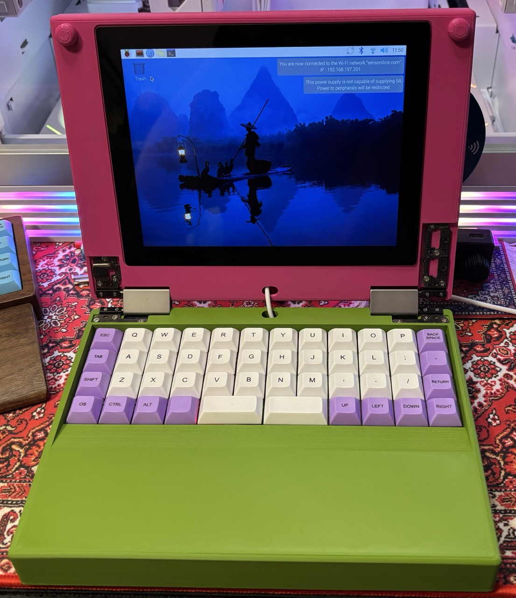
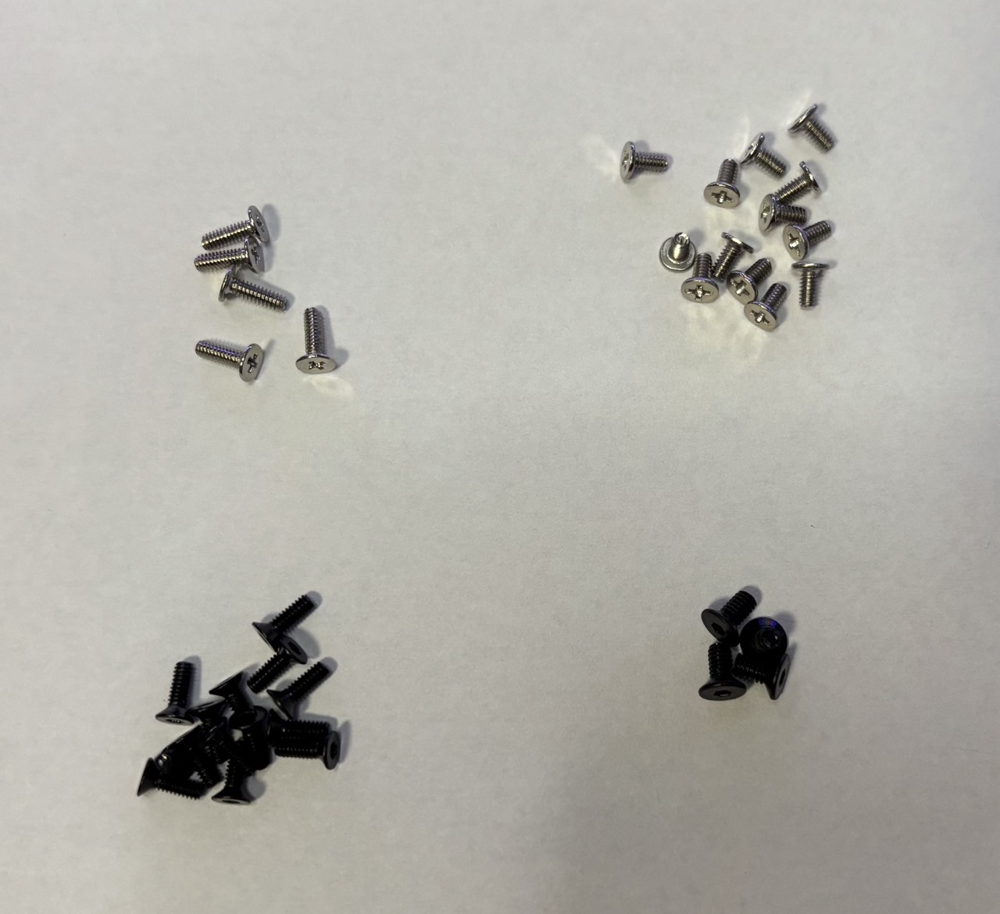
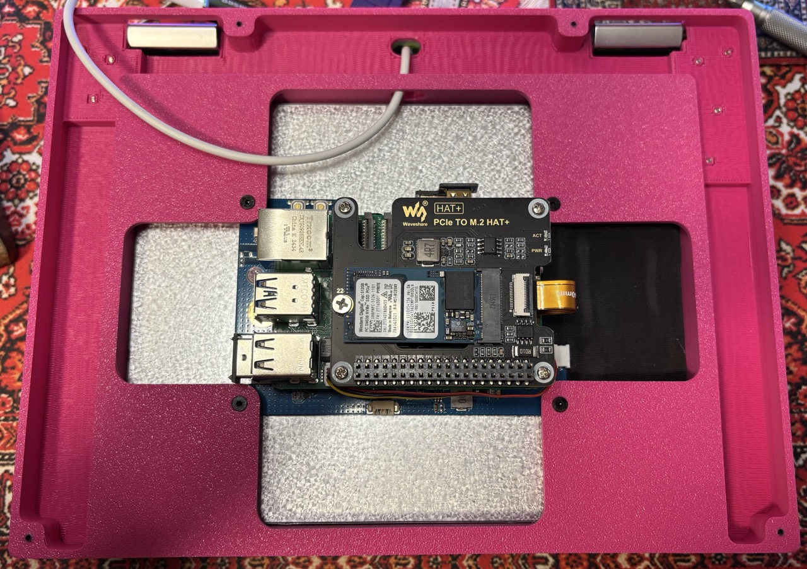
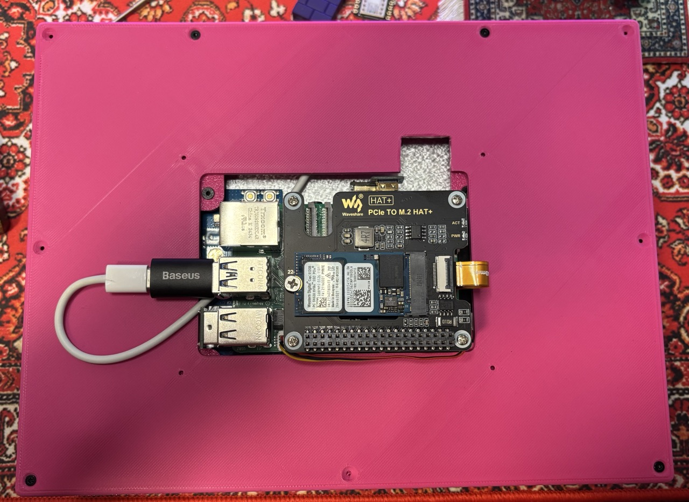
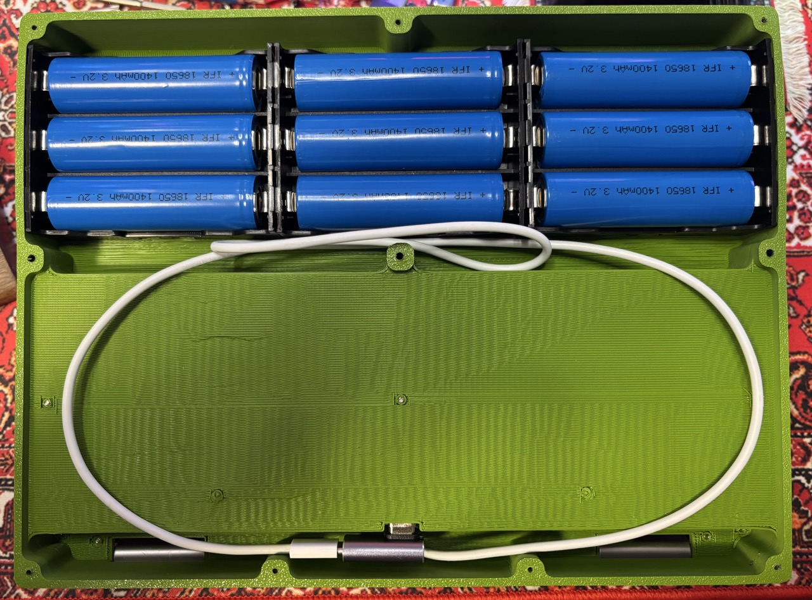
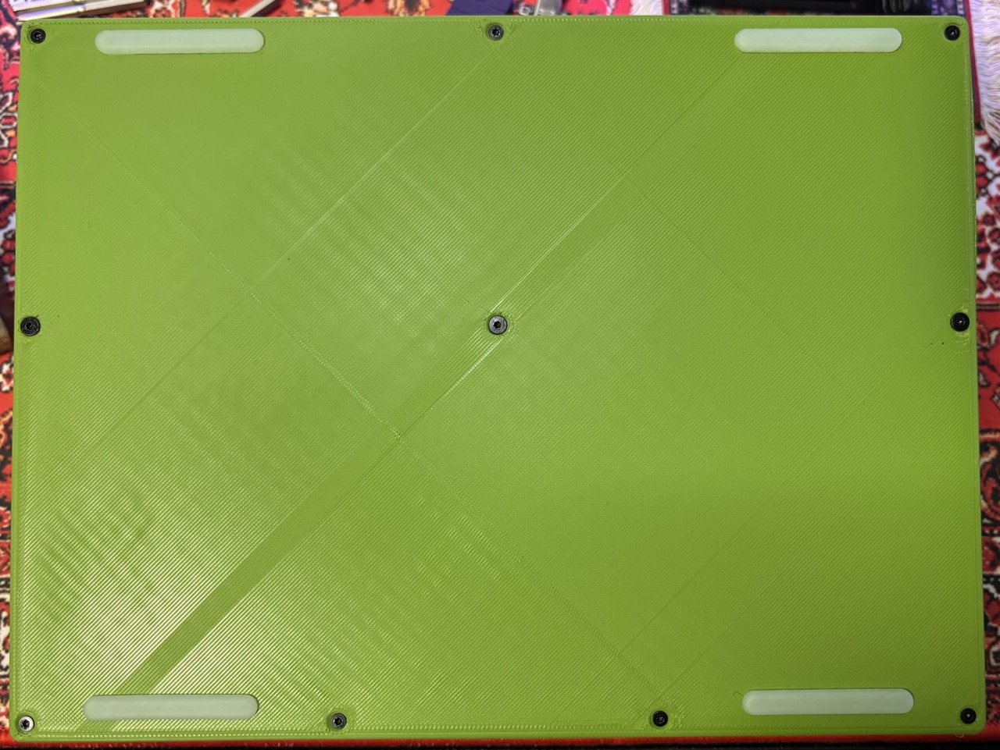
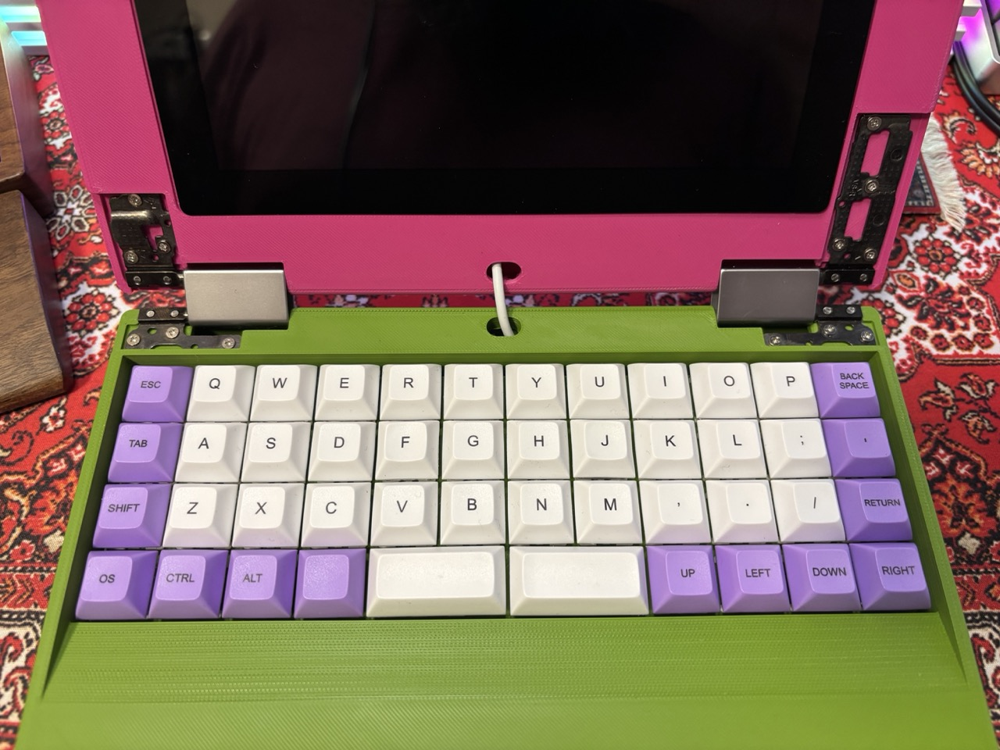

# Homebrew Laptop Project

A small pet project of a laptop with several custom features. A hobby project done by an amateur in mechanical and PCB engineering, born from a desire to have an ortholinear keyboard and an ARM CPU in a small laptop form factor and hugely inspired by [MNT Pocket Reform](https://source.mnt.re/reform/pocket-reform).

---

## 🔖 Overview

The main features of the first prototype:

- Ortholinear mechanical keyboard (full-size switches)
- 4:3 aspect ratio LCD
- Compatible with Raspberry Pi 5 + Active cooling + NVMe SSD shield
- Battery compartment non-functional (for weight only)
- Uses hinges from the old laptop
- Powered by an external DC power supply
- The case can be printed on a 3D printer

Features that I plan to add next:

- Custom ortholenear low-profile keyboard
- Touchpad or Trackball
- Better LCD without HDMI controller (thinner)
- Custom motherboard for Raspberry Pi Compute Module 5 and SSD
- Functional Battery Controller
- Custom-designed hinges
- Brass inserts for 3D printed case
- Machined aluminum case (not in the near future)

---

## 📁 Repository Contents

| File | Description |
|------|-------------|
| `case` | Folder containing the files for case 3D printing |
| `images` | Folder containing the photos of the assembly process | 
| `LICENSE` | This repository license file |
| `README.md` | This file |

---

## 💻 Case assembly

### Parts used

In addition to the 3d printed case parts, several other things are used:

- [YMDK Air40 keyboard PCB](https://ymdkey.com/products/ymd40-air40-rgb-hot-swap-pcb) with plate, some switches and keycaps
- Some USB-C to USB-A cable (I used the Apple C to C cable) and an angle adapter
- 9 x 18650 battery cells with 3 x PCB holders for 3 batteries each. It is not strictly required since batteries are used only for weight in the current version, and it can be replaced with any heavy object
- [Waveshare 8inch 768x1024 LCD](https://www.waveshare.com/wiki/8inch_768x1024_LCD)
- [Raspberry Pi 5](https://www.raspberrypi.com/products/raspberry-pi-5/) with some cooling (active cooling prefered)
  - For cooling, I used [Argon THRML 30mm Active Cooler](https://argon40.com/products/argon-thrml-30mm-active-cooler)
  - For NVMe [Waveshare PCIe TO M.2 HAT+](https://www.waveshare.com/wiki/PCIe_TO_M.2_HAT+)
- Hinges from Lenovo IdeaPad Flex 5
- 5 x M2x6 screws for Keyboard
- 13 x M2x4 screws for Hinges
- 14 x M2x6 hidden screws for Cowers
- 4 x M2.5x5 hidden screws for LCD

### Assembly

1. Assemble the LCD and Raspberry Pi according to the [LCD manual](https://www.waveshare.com/wiki/8inch_768x1024_LCD)
2. Perform the [Software Setup](#software-setup) on this stage, befor continuing assembly
3. Put the LCD into the Body Top case and secure with 4 x M2.5x5 hidden screws
4. Put the keyboard USB cable through the cable holes, but don't connect to the Raspberry Pi yet

5. Put the Cover Top on the Body Top, put the cable together with Raspberry through the window, and secure the cover with 4 x M2x6 hidden screws
6. Connect the keyboard USB to the Raspberry Pi

7. Place the Keyboard PCB into the keyboard compartment of the Body Bottom and secure it with 5 x M2x6 screws before installing the plate, switches, and keycaps. After securing the Keyboard PCB, you can install the plate, switches, and keycaps according to the keyboard assembly manual
8. Put the keyboard USB cable through the cable hole and connect it to the keyboard. You can put the excess length of cable into the bottom compartment
9. Put the batteries into the holders and the compartment, or put another weight there

10. Put the Cover Bottom on the Body Bottom and secure the cover with 10 x M2x6 hidden screws

11. Put the Hinges into the corresponding places and secure them with 13 x M2x4 screws

### Software Setup

Better to perform the software setup before assembling the case

1. Prepare boot USB stick using [Raspberry Pi Imager](https://www.raspberrypi.com/software/).
2. After flashing the OS to the USB stick, mount the partitions on the USB to your system. You should see config.txt on one of the partitions. Perform required modifications to the config.txt according to the [LCD manual](https://www.waveshare.com/wiki/8inch_768x1024_LCD). Additionally, you can set usb_max_current_enable=1 to bypass the boot confirmation for high current consumption.
3. Insert the USB stick into the Raspberry Pi and connect the power. First boot will be performed from the USB stick. After the system boots up, you can install the OS directly to the SSD using Pi Imager from the Raspberry Pi, or continue working from the USB stick. The SD card will not fit with the case assembled since it was intended for the SSD only.
4. You may need to adjust display rotation in the OS Display Settings menu.

---

## 📬 Contributing

You may submit pull requests or fork the repo. But since it is a hobby project, I may respond with significant delays

---

## 📄 Notes

That is not a carpet in the photo. It is a carpet-style mouse pad 🙃

---

## 🌸 License

Licensed under the [Flower License](./LICENSE) 🌸
